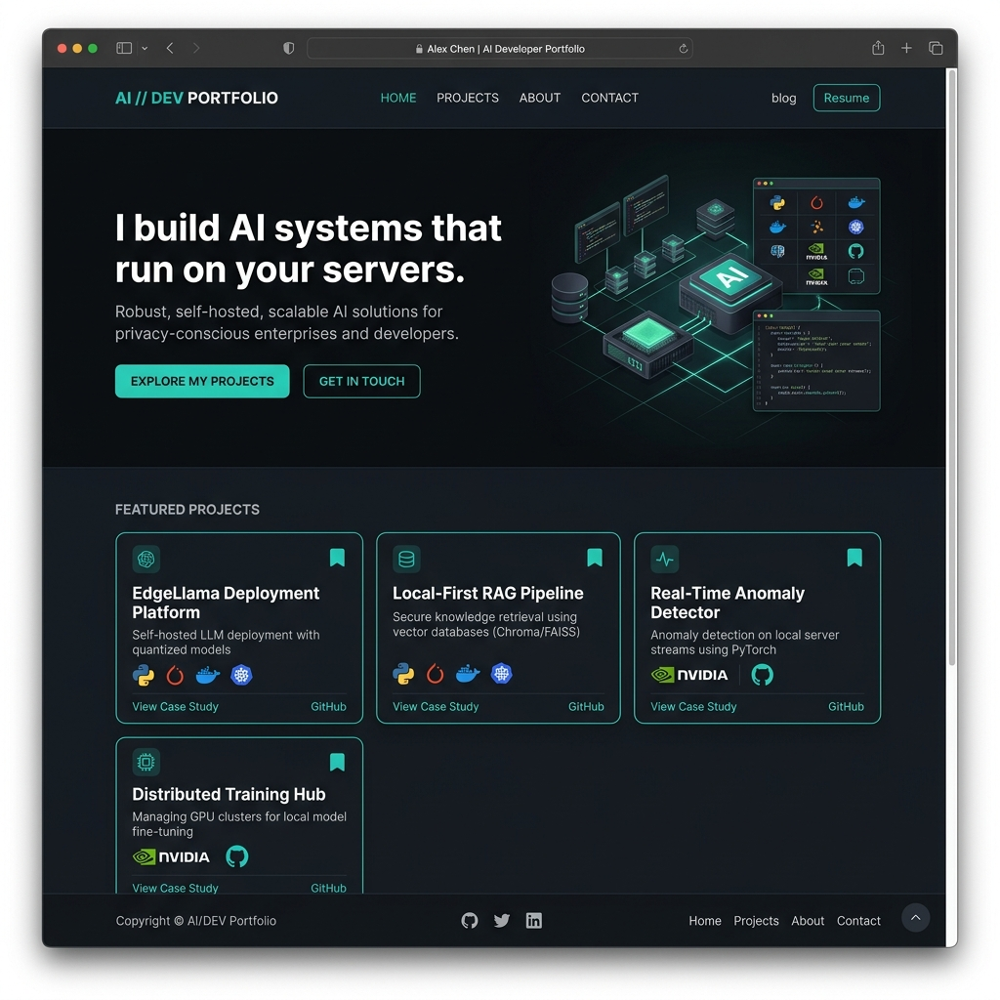

<div align="center">
  
  
  
  
  <br />
  
  
</div>

<br />

<div align="center">
  <h1>⚡ Murali Krishna · AI Systems Engineer</h1>
  <p><strong>I build AI systems that run on <em>your</em> servers.</strong></p>
  <p>
    <a href="https://muralikrishna.dpdns.org" target="_blank">🌐 Live Demo</a> · 
    <a href="https://linkedin.com/in/muralikrishnakuppala" target="_blank">💼 LinkedIn</a> · 
    <a href="https://github.com/murali19980" target="_blank">🐙 GitHub</a>
  </p>
</div>

<br />

## 📸 Preview

<p align="center">
  
  <br />
  <em>Dark, developer-first design focused on readability and technical credibility.</em>
</p>

> ⚠️ **Note**: Replace `screenshot.png` with an actual screenshot of your live site to make this shine!

---

## 🚀 About This Portfolio

This repository contains the source code for my personal portfolio. It is a **single-page, static website** designed to showcase my expertise as an **AI Systems Engineer** specializing in:

- **Local-first AI** (Ollama, LM Studio)
- **Multi-agent Orchestration** (LangGraph, LangChain)
- **RAG Pipelines** (ChromaDB, Qdrant)
- **Zero-cost inference** and **data privacy**

### ✨ Key Features

- **Clean, minimalist UI** with a dark theme and vibrant teal accents.
- **Fully responsive** — optimized for desktop, tablet, and mobile.
- **Smooth scrolling** and subtle hover interactions.
- **Accessible** typography using Sora, DM Sans, and Fira Code.
- **No external dependencies** besides Google Fonts.

---

## 🛠️ Tech Stack

| Layer | Technology |
| :--- | :--- |
| **Markup** | HTML5 |
| **Styling** | CSS3 (Custom Properties, Flexbox, Grid) |
| **Interactivity** | Vanilla JavaScript (ES6) |
| **Fonts** | Google Fonts (Sora, DM Sans, Fira Code) |
| **Deployment** | Custom Domain (`muralikrishna.dpdns.org`) |

---

## 🏃‍♂️ Run Locally

To run this portfolio on your local machine:

```bash
# 1. Clone the repository
git clone https://github.com/murali19980/portfolio-1.git

# 2. Navigate into the directory
cd portfolio-1

# 3. Open the index.html file in your browser
open index.html   # macOS
# or
start index.html  # Windows
# or
xdg-open index.html # Linux
```
